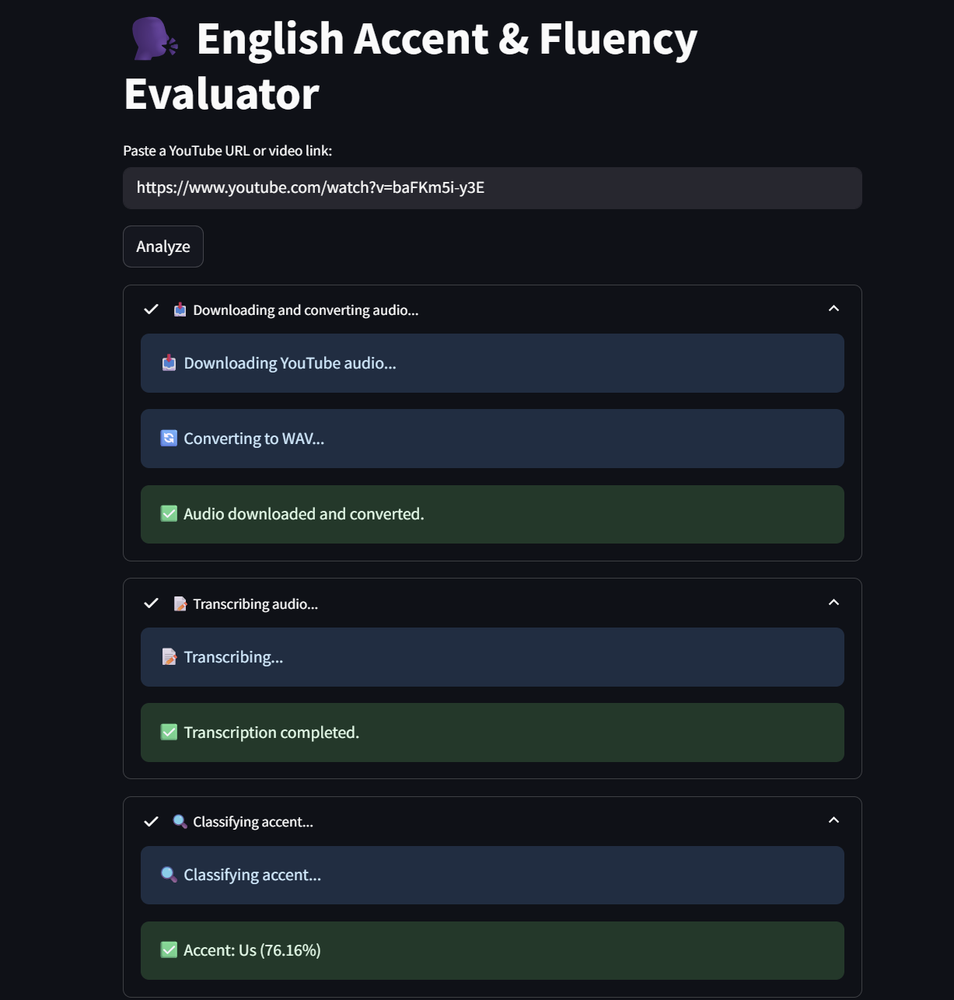
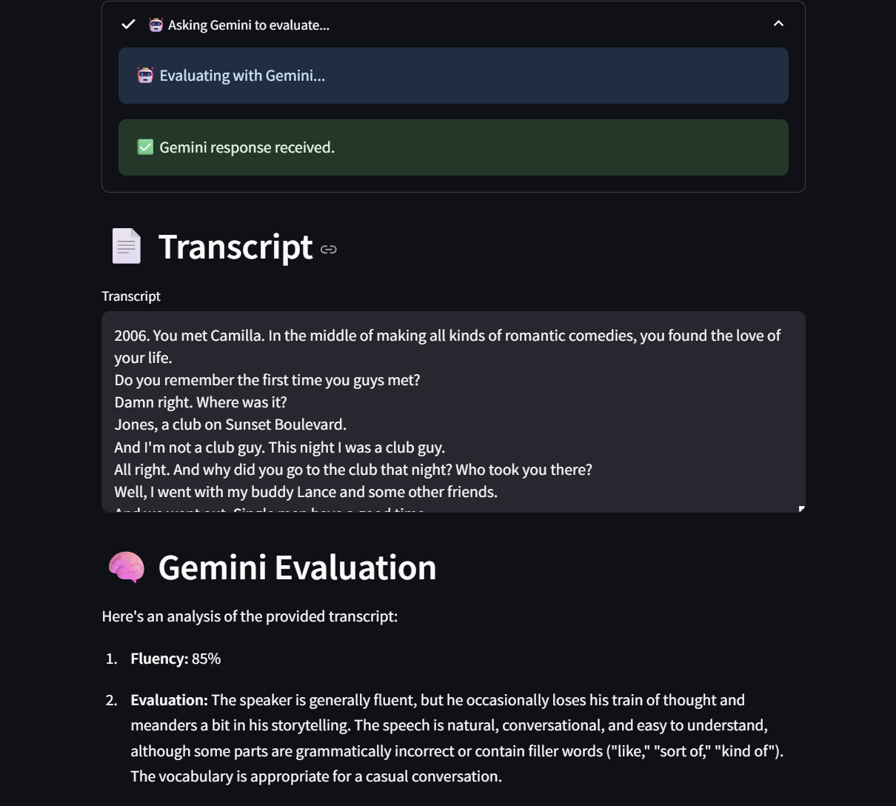

# English Accent & Fluency Evaluator

This Streamlit app allows you to evaluate spoken English in videos using a combination of:
- **YouTube or direct video URL audio extraction**
- **Speech-to-text transcription** (via [faster-whisper](https://github.com/SYSTRAN/faster-whisper))
- **Accent classification** (via Hugging Face model)
- **Fluency evaluation** (via Google Gemini API)

---

## Features

- Download and convert audio from YouTube or direct URLs
- Transcribe audio using `faster-whisper`
- Detect the speaker's English accent (e.g. British, American, Indian, etc.)
- Evaluate speaking fluency and quality via Google Gemini
- Visual feedback during all stages, including progress bars

---

## Limitations & Notes

- **Max video length: 5 minutes**  
  Due to memory limits on Streamlit Cloud, only short videos (under 5 minutes) are supported for now. Longer videos may crash the app or timeout.

- **Using the "tiny" Whisper model**  
  The app uses the `tiny` variant of the `faster-whisper` model to reduce RAM usage. This keeps things fast and lightweight but may reduce transcription accuracy, especially for nuanced or unclear speech.

- **Room for improvement**  
  This is intended as a **proof of concept**. For production use, consider:
  - Using a larger Whisper model (e.g. `base`, `medium`) if resources allow
  - Improving preprocessing (noise reduction, speaker diarization)
  - Providing better UX/error handling for long videos or poor audio quality

---

## Demo

<p align="center">
  
  
</p>

---

## Dependencies

Make sure you have **Python 3.10 or 3.11**. Python 3.13+ may cause runtime errors due to incompatibility with PyTorch.

Install the required libraries:

```bash
pip install -r requirements.txt
